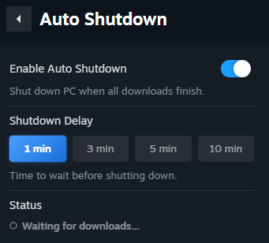
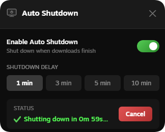

# Auto Shutdown

A Millennium plugin that automatically shuts down your PC after Steam game downloads are complete.

## Features ✨

<table><tr><td></td><td></td></tr></table>

The plugin adds a **tab button on the left side** of the Downloads page, vertically centered on the screen. Click the arrow to slide open the Auto Shutdown panel. The button moves to the right edge of the panel when open. You can customize the button color and overlay behavior in **Steam → Settings → Plugin Settings → Auto Shutdown**.

- Monitors active Steam downloads in real time
- Shows a toast notification when downloads finish
- Configurable shutdown delay — 1, 3, 5, or 10 minutes
- Cancel button to abort the shutdown at any time
- Enabled by default, no setup required

## Prerequisites

- [Millennium](https://steambrew.app)
- Windows only
